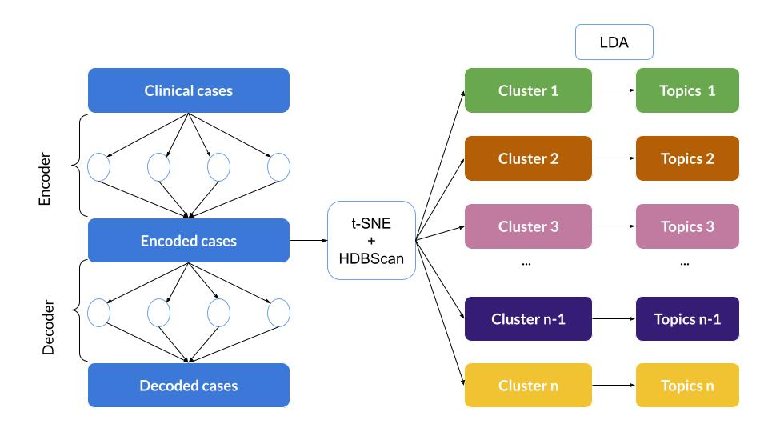
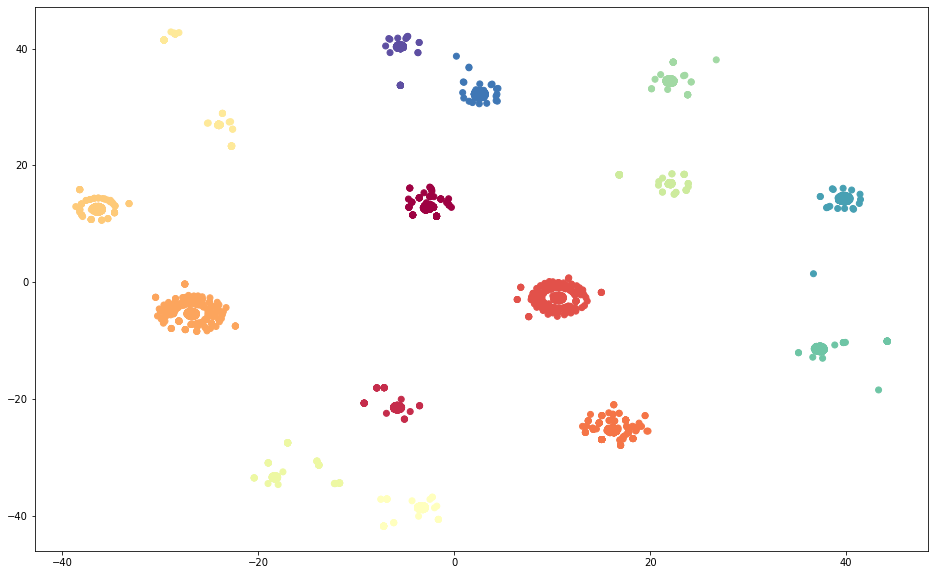

# bitsxlaMarato Hackathon - Clinical text similarity Challenge
# COVID-CaseExplore

Contributors: Diego Torres Dho, Paul Rognon

### Watch the video on Barcelona Supercomputing Center's Youtube channel
https://youtu.be/BIXe51fdDCA

### Check the full presentation [here](Covid_CaseExplore.pdf)

## The Challenge

- Today, we have a huge amount of clinical records. One of the main types is text in the form of clinical cases.
- A lot of medically relevant information is hidden in the mass of clinical cases.
- Finding clinically similar cases can help prognosis, diagnosis and decision making.

## Our idea: Grouping similar cases to learn more with AI

*AI to represent the cases*
- Neural networks are currently the best tools to model text and language.
- Autoencoder like networks can learn a numerical representation of the text of our clinical cases.

*Clusters to find patterns and decide*
- Beyond pairwise similarity, clusters help characterizing the similarity of cases.
- New cases can be assigned to a group for decision-making.

## Possible applications

***Knowledge discovery***
- Find comorbidities as other types of disease can appear to characterize a cluster of COVID-19 cases.
- Find subtypes of COVID-19 cases that can be characterized by severity, progression speed, symptomes or other traits. 
***Taking decisions***
- Assist medical professionals in triage by assigning a new case to a cluster characterized by the severity.
- Assist medical professionals in designing an adequate response to a new patient case.

## How do we do it? An overview

## How do we do it? Some technical details

***Autoencoder***  
The encoder has 1 LSTM layer followed by a dense layer. The decoder has a bidirectional LSTM layer followed by a dense layer. We set the encoder output dimension at 64.

***Clustering***  
We first obtain a two dimensional t-SNE representation of the encoder output using cosine similarity as metric and Barnes-Hut method. We then run HDBScan.

***Latent Dirichlet Allocation (LDA)***  
We first pre-process our data by tokenizing, stemming, removing stop words, very uncommon and common words. We then extract five 15-word dominant topics.

## Some initial results

***Clearly defined clusters***  

***Informative clusters***  
- Our algorithm differentiates COVID-19 related clusters of cases from non-COVID-19 related clusters.  In 3 clusters, COVID-19  is the most dominant and second most dominant topic.
- In 1 of those clusters, kidney diseases and male gender are two other salient traits in the dominant topics.
- 1 of those clusters is highly related with cancer terms along with COVID-19.

## What's next for COVID-CaseExplore?
- Building a strong pre-processing of case text to avoid clustering on non-significant words.
- Using pre-trained word embeddings to improve the encoding of the cases.
- Extracting more significant knowledge from the clusters with the help of medical professionals.

